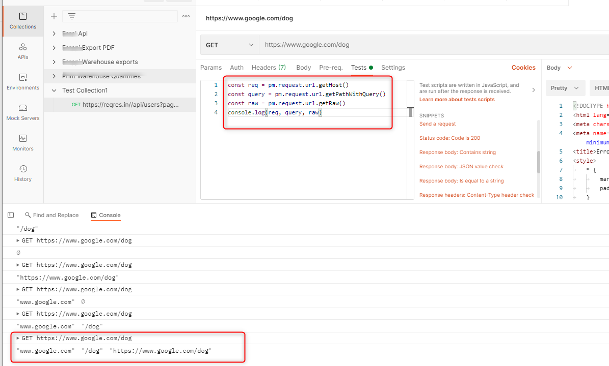
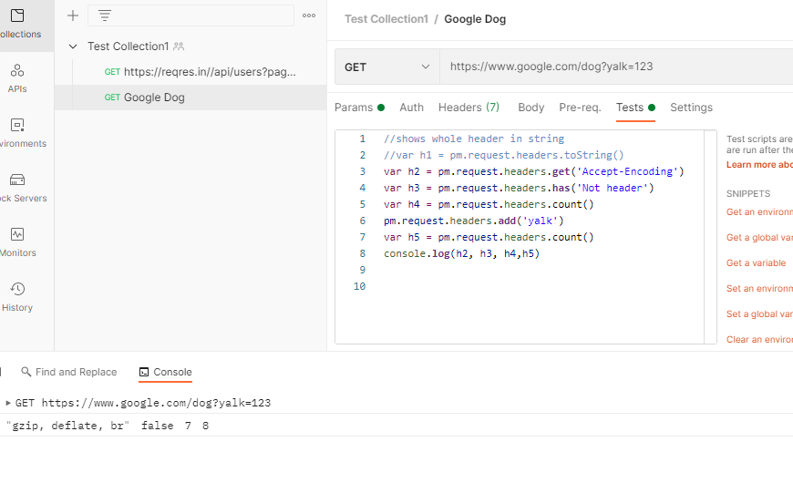
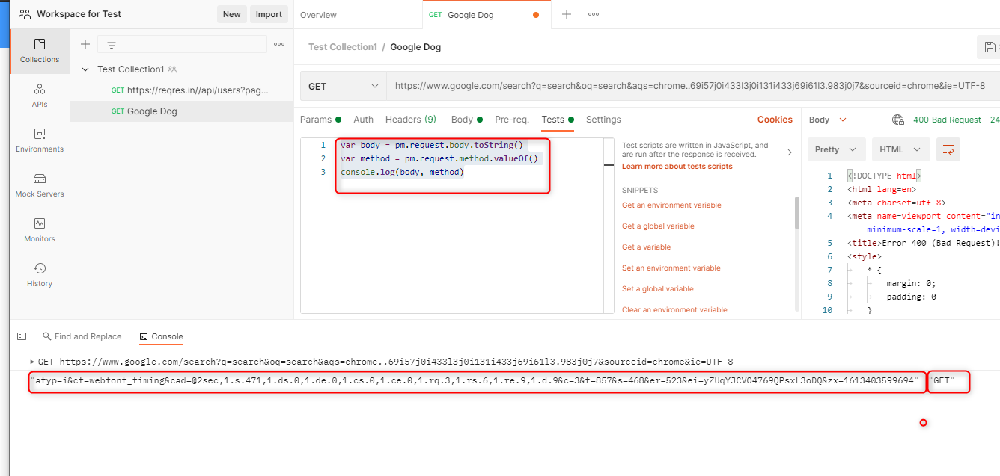

# Postman Scripting

## Postman Variables
### Types of variable
- Global
- Environment
- Collection
- Data
- Local
### Get , Set, unset format
For collectionVariables, environment, global use pm. format <br>
Get <br>
```
pm.variable.get('variable') 
```
Set <br>
```
pm.variable.set('variable') 
```
Unset <br>
```
pm.variable.unset('variable')
```
Replace (use the var) <br>
```
pm.variables.replaceIn("Hi, my name is {{variable}}");
```
## Working with Requests
### The request URL: <br/>
```
const req = pm.request.url.getHost()
const query = pm.request.url.getPathWithQuery()
const raw = pm.request.url.getRaw()
console.log(req, query, raw)
```


### The request Header: <br/>
```
//shows whole header in string
//var h1 = pm.request.headers.toString()
var h2 = pm.request.headers.get('Accept-Encoding')
var h3 = pm.request.headers.has('Not header')
var h4 = pm.request.headers.count()
pm.request.headers.add('yalk')
var h5 = pm.request.headers.count()
console.log(h2, h3, h4,h5)
```
More examples: <br/>
```
pm.request.headers.add({
  key: "client-id",
  value: "abcdef"
});
//when already exists then it will update
pm.request.headers.upsert({
  key: "client-id",
  value: "123456"
});
```


### The request Body and method: <br/>
```
var body = pm.request.body.toString()
var method = pm.request.method.valueOf()
console.log(body, method)
```



# Postman common pre requests

# Writing Postman Assertions
# Chaining Postman Requests
